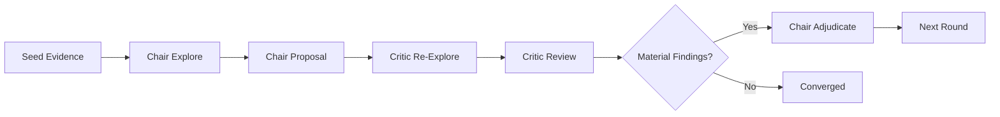
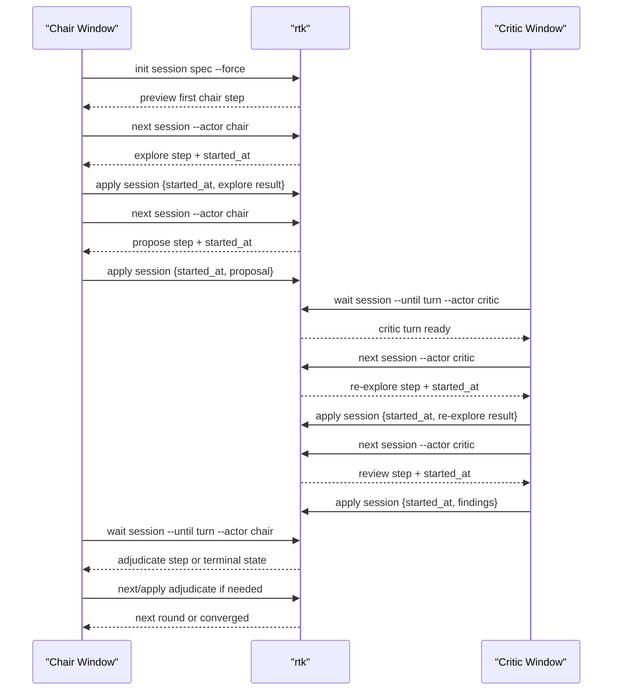

# Roundtable Kernel

[](https://github.com/yansircc/roundtable-kernel/actions/workflows/ci.yml)

`roundtable-kernel` is a small deliberation kernel for multi-LLM discussion.

It does one thing: run a roundtable where semantic truth lives in `evidence`, `findings_against_proposal`, `verdict`, and `convergence`, while streams and provider logs remain observability only.



The kernel has two operating modes:

- `run`: autonomous execution from a spec.
- `init` / `next` / `apply` / `wait`: live handoff protocol where any TUI window or external LLM can become `chair` or `critic`.

Default output is JSON. Use `--text` only when a human wants a rendered summary.

## Install

Build the CLI from source:

```bash
cd /Users/yansir/code/52/roundtable-kernel
make build
./rtk -h
```

Install it onto your `PATH`:

```bash
cd /Users/yansir/code/52/roundtable-kernel
make install
rtk version
```

If `rtk` is not found after `make install`, add Go's bin directory to your shell `PATH` and reload the shell:

```bash
export PATH="$(go env GOPATH)/bin:$PATH"
```

If you want `rtk serve` from a source checkout, build the UI bundle once:

```bash
cd /Users/yansir/code/52/roundtable-kernel
make build-ui
```

Autonomous run:

```bash
rtk run my-session /absolute/path/to/spec.json --force
rtk show my-session
```

Live handoff:

```bash
rtk init my-session /absolute/path/to/spec.json --force
rtk next my-session --actor chair
rtk apply my-session result.json
rtk wait my-session --until turn --actor critic
```

Start the UI:

```bash
rtk serve --port 3133
```

Then open [http://127.0.0.1:3133](http://127.0.0.1:3133).

Release tags matching `v*` build GitHub release archives automatically. Each archive contains the `rtk` binary, `README.md`, and the built `ui/dist` bundle.

This project is released under the MIT License. See [LICENSE](/Users/yansir/code/52/roundtable-kernel/LICENSE).

## CLI

```bash
rtk init <session-id> <spec-path> [--force]
rtk run <session-id> <spec-path> [--force] [--text]
rtk next <session-id> [--actor name]
rtk apply <session-id> [result.json|-]
rtk stop <session-id>
rtk wait <session-id> [--until change|turn|terminal] [--actor name] [--since updated_at] [--timeout-ms 600000]
rtk show <session-id> [--text]
rtk list [--text]
rtk serve [--port 3133]
rtk help <command>
rtk version
```

`rtk -h`, `rtk --help`, and `rtk help <command>` are the intended discovery path for agents and humans.

## Development

```bash
make test-unit
make test-integration
make ci
```

The CI workflow runs unit tests, integration tests, CLI build checks, and UI build checks.

## Live Protocol

`init` creates durable session state and previews the next step. It does not claim work.

`next` is the only command that claims a step. It marks the phase as `running` and returns a `started_at` token.

`apply` completes the currently running step. The caller should echo the `started_at` token it received from `next`, which prevents stale writes from another actor window.

`apply.result` may include reserved execution metadata under `_rtk.usage`. The kernel strips that metadata from the semantic payload and stores it on the phase record. Provider-reported cost remains exact when available; OpenAI/Codex cost is otherwise derived from official per-token pricing as a token-only estimate and marked as approximate.

`stop` marks the session as durably terminal. `next`, `wait --until terminal`, and autonomous `run` all treat `stopped` as a first-class terminal state.

`wait` blocks on session-file changes and returns the same JSON envelope shape as `next`. Useful patterns:

- `wait <session> --until turn --actor critic`: block until a critic turn is ready.
- `wait <session> --until terminal`: block until the discussion converges, fails, exhausts rounds, or is stopped.
- `wait <session> --until change --since <updated_at>`: block until durable semantic state changes.

This means the current Codex chat, Claude Code, another Codex TUI, or a custom agent loop can all act as `chair` or `critic` as long as they speak `next/apply`.

All actor windows share the same `session_id`. A typical two-window handoff looks like this:



## Spec Shape

The kernel runs exactly one execution mode: `exec`.

The spec provides:

- the topic
- the chair and critics
- a base command template
- optional per-actor command overrides
- optional seed evidence

Minimal example:

```json
{
  "topic": "Derive a minimal implementation plan for feature X.",
  "chair": "opus",
  "critics": ["gpt-5.4", "sonnet"],
  "seed_batch": {
    "actor": "opus",
    "collected_by": "opus",
    "items": [
      {
        "key": "seed-1",
        "source": "repo/path:1-20",
        "kind": "reference",
        "statement": "A concrete starting fact.",
        "excerpt": "The exact supporting excerpt."
      }
    ]
  },
  "agent": {
    "cmd": [
      "go",
      "run",
      "./cmd/claude-agent",
      "--workspace",
      "/absolute/path/to/target-repo",
      "--model",
      "sonnet",
      "--settings",
      "/absolute/path/to/minimal-claude-settings.json"
    ],
    "cwd": "/absolute/path/to/roundtable-kernel",
    "timeout_ms": 600000
  },
  "actors": {
    "gpt-5.4": {
      "cmd": [
        "go",
        "run",
        "./cmd/codex-agent",
        "--workspace",
        "/absolute/path/to/target-repo",
        "--model",
        "gpt-5.4",
        "--sandbox",
        "read-only"
      ],
      "cwd": "/absolute/path/to/roundtable-kernel",
      "timeout_ms": 600000
    }
  }
}
```

`max_rounds` is optional. Omit it for an unbounded session, or set a positive integer to cap rounds.

`agent.timeout_ms` and per-actor `timeout_ms` are optional. The default is `600000` (10 minutes).

For every phase, the kernel sends one JSON document to the selected agent command over stdin:

```json
{
  "protocol": "roundtable-kernel.exec.v1",
  "actor": "sonnet",
  "phase": "review",
  "round": 2,
  "session": { "...": "durable semantic truth so far" },
  "proposal": { "...": "present for review/adjudicate" },
  "findings": [{ "...": "present for adjudicate" }]
}
```

The command must print one JSON document to stdout:

- `explore` / `re-explore`: `{ "items": [...] }`
- `propose`: `{ "proposal": { ... } }`
- `review`: `{ "findings": [...] }`
- `adjudicate`: `{ "verdict": { ... } }`

## Wrappers

Two wrappers are included:

- [cmd/claude-agent/main.go](/Users/yansir/code/52/roundtable-kernel/cmd/claude-agent/main.go)
- [cmd/codex-agent/main.go](/Users/yansir/code/52/roundtable-kernel/cmd/codex-agent/main.go)

Both wrappers:

- read one roundtable request from stdin
- build a phase-specific prompt and schema
- return one semantic JSON document on stdout
- keep provider/runtime details out of the kernel

Claude auth can be injected entirely through environment variables. For example:

```bash
ANTHROPIC_BASE_URL="https://your-relay.example" \
ANTHROPIC_AUTH_TOKEN="..." \
rtk run my-session /absolute/path/to/spec.json --force
```

## Durable Outputs

Each run writes two durable artifacts:

- `sessions/<id>.json`: semantic truth
- `telemetry/<id>.jsonl`: runtime telemetry sidecar

This split is intentional. UI and operators can read both, but only the session file is source of truth. `wait` and `show` read the durable session, not stream output.

## UI

The UI serves:

- `GET /api/sessions`
- `GET /api/session/:id`
- `GET /api/telemetry/:id`
- `GET /api/telemetry/:id?since=N`

The panel is meant to answer two human questions quickly:

- What does the kernel currently believe?
- What did the agents actually do while producing that state?

## Agent Skill

The repo includes a repo-local Codex skill at [.codex/skills/rtk/SKILL.md](/Users/yansir/code/52/roundtable-kernel/.codex/skills/rtk/SKILL.md).

The skill is self-contained. It bundles a launcher under [.codex/skills/rtk/scripts/rtk](/Users/yansir/code/52/roundtable-kernel/.codex/skills/rtk/scripts/rtk), a platform-specific `rtk` binary under `scripts/`, and static UI assets under `ui/dist/`, so agents do not need a separate global `rtk` install.

Refresh the bundled assets with:

```bash
./scripts/package-rtk-skill.sh
```

Export the same self-contained skill into a plugin-style directory with:

```bash
./scripts/package-rtk-skill.sh /absolute/path/to/plugin/skills/rtk
```

Publish the same skill into the `yansircc/agent-skills` marketplace with GitHub Actions via [.github/workflows/publish-skill.yml](/Users/yansir/code/52/roundtable-kernel/.github/workflows/publish-skill.yml). The workflow expects an `AGENT_SKILLS_PUSH_TOKEN` secret with direct push access to `agent-skills` and syncs the generated plugin into `main`.

The skill still teaches agents to prefer `rtk` over custom polling or log scraping:

- use `rtk show` for durable state
- use `rtk wait` for blocking handoff
- use `rtk next` and `rtk apply` for live participation
- treat telemetry as observability, not truth

## Design Constraints

- Events are observability only, not state.
- Evidence IDs are runtime-assigned.
- A `supported` finding must cite evidence IDs.
- A `gap` finding must cite none.
- Severity lives on findings, not verdict decisions.
- A clean critic pass converges even if adjudication is skipped.

## Deliberate Omissions

- no provider-specific kernel logic
- no stream-driven truth
- no retry policy in the semantic core
- no workflow engine outside the roundtable loop
