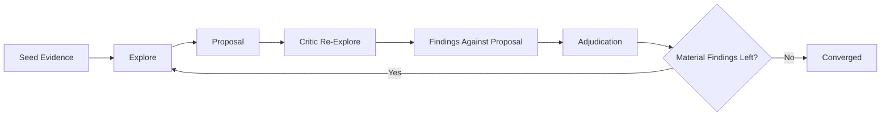

# Roundtable Kernel

`roundtable-kernel` is a small deliberation kernel for multi-LLM discussion.

It does one thing: run a bounded roundtable where semantic truth lives in `evidence`, `findings`, `verdict`, and `convergence`, while streams and provider logs remain observability only.



## What You Can Do

- Run one discussion from a JSON spec.
- Inspect the durable session state after each run.
- Serve a local UI for sessions and telemetry.
- Swap Claude and Codex wrappers without changing kernel semantics.

## Quickstart

Build the UI once:

```bash
cd /Users/yansir/code/52/roundtable-kernel
npm --prefix ui install
npm --prefix ui run build
```

Run one session:

```bash
go run ./cmd/rtk run my-session /absolute/path/to/spec.json --force
go run ./cmd/rtk show my-session
```

Start the UI:

```bash
go run ./cmd/rtk serve --port 3133
```

Then open [http://127.0.0.1:3133](http://127.0.0.1:3133).

## CLI

```bash
go run ./cmd/rtk run <session-id> <spec-path> [--force]
go run ./cmd/rtk show <session-id> [--json]
go run ./cmd/rtk list
go run ./cmd/rtk serve [--port 3133]
```

## Spec Shape

The kernel runs exactly one execution mode: `exec`.

The spec provides:

- the topic
- the chair and critics
- a base command template
- optional per-actor command overrides
- optional seed evidence

Minimal example:

```json
{
  "topic": "Derive a minimal implementation plan for feature X.",
  "chair": "opus",
  "critics": ["gpt-5.4", "sonnet"],
  "max_rounds": 3,
  "seed_batch": {
    "actor": "opus",
    "collected_by": "opus",
    "items": [
      {
        "key": "seed-1",
        "source": "repo/path:1-20",
        "kind": "reference",
        "statement": "A concrete starting fact.",
        "excerpt": "The exact supporting excerpt."
      }
    ]
  },
  "agent": {
    "cmd": [
      "go",
      "run",
      "./cmd/claude-agent",
      "--workspace",
      "/absolute/path/to/target-repo",
      "--model",
      "sonnet",
      "--settings",
      "/absolute/path/to/minimal-claude-settings.json"
    ],
    "cwd": "/absolute/path/to/roundtable-kernel",
    "timeout_ms": 300000
  },
  "actors": {
    "gpt-5.4": {
      "cmd": [
        "go",
        "run",
        "./cmd/codex-agent",
        "--workspace",
        "/absolute/path/to/target-repo",
        "--model",
        "gpt-5.4",
        "--sandbox",
        "read-only"
      ],
      "cwd": "/absolute/path/to/roundtable-kernel",
      "timeout_ms": 300000
    }
  }
}
```

For every phase, the kernel sends one JSON document to the selected agent command over stdin:

```json
{
  "protocol": "roundtable-kernel.exec.v1",
  "actor": "sonnet",
  "phase": "review",
  "round": 2,
  "session": { "...": "durable semantic truth so far" },
  "proposal": { "...": "present for review/adjudicate" },
  "findings": [{ "...": "present for adjudicate" }]
}
```

The command must print one JSON document to stdout:

- `explore` / `re-explore`: `{ "items": [...] }`
- `propose`: `{ "proposal": { ... } }`
- `review`: `{ "findings": [...] }`
- `adjudicate`: `{ "verdict": { ... } }`

## Wrappers

Two wrappers are included:

- [cmd/claude-agent/main.go](/Users/yansir/code/52/roundtable-kernel/cmd/claude-agent/main.go)
- [cmd/codex-agent/main.go](/Users/yansir/code/52/roundtable-kernel/cmd/codex-agent/main.go)

Both wrappers:

- read one roundtable request from stdin
- build a phase-specific prompt and schema
- return one semantic JSON document on stdout
- keep provider/runtime details out of the kernel

Claude auth can be injected entirely through environment variables. For example:

```bash
ANTHROPIC_BASE_URL="https://your-relay.example" \
ANTHROPIC_AUTH_TOKEN="..." \
go run ./cmd/rtk run my-session /absolute/path/to/spec.json --force
```

## Durable Outputs

Each run writes two durable artifacts:

- `sessions/<id>.json`: semantic truth
- `telemetry/<id>.jsonl`: runtime telemetry sidecar

This split is intentional. UI and operators can read both, but only the session file is source of truth.

## UI

The UI serves:

- `GET /api/sessions`
- `GET /api/session/:id`
- `GET /api/telemetry/:id`
- `GET /api/telemetry/:id?since=N`

The panel is meant to answer two human questions quickly:

- What does the kernel currently believe?
- What did the agents actually do while producing that state?

## Design Constraints

- Events are observability only, not state.
- Evidence IDs are runtime-assigned.
- A `supported` finding must cite evidence IDs.
- A `gap` finding must cite none.
- Severity lives on findings, not verdict decisions.
- A clean critic pass converges even if adjudication is skipped.

## Deliberate Omissions

- no provider-specific kernel logic
- no stream-driven truth
- no retry policy in the semantic core
- no workflow engine outside the bounded roundtable loop
